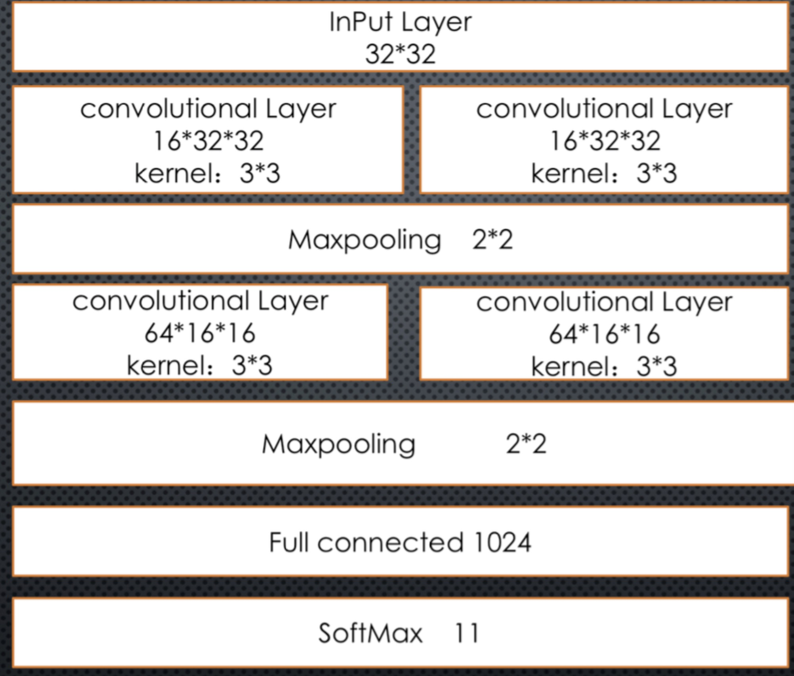
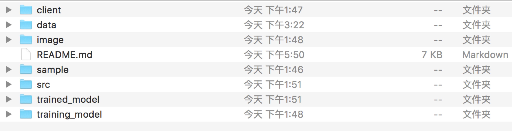

### 							MFC-CNN 

---

`Malware Families Classification Based On CNN`

​	It is helpful for virus analysis engineer to classify malware’s family efficiently and accurately. A plenty of methods about malware’s family autonomic classification has been proposed. Such as , D Krishna Sandeep Reddy and Arun K Pujari proposed a novel method in their paper ( N-gram analysis for computer virus detection ),Robert Moskovitch proposed a method using OPCODE to detect malwares in his paper (Unknown Malcode Detection Using OPCODE Representation),L.Nataraj in his paper (malware Images : visualization and Automatic Classification) give us a whole new approach using image processing techniques to classify malware families.

​       InL.Natarai’s method, Malware binaries are visualized as gray-scale images, with the observation that for many malware families, the images belonging to the same family appear very similar in layout and texture. So they have proposed a classification method using standard image features. 

​       Consider the CNN model has been widely used in image processing area and many benefits of it, we decided to combine the CNN model with L.Natara’s approach. One benefit of CNN is that we don’t need to extract features of images used to classify by ourselves, CNN will do the feature extraction work voluntarily.

​	Firstly, we transform malware binary files into gray-scale images (32*32). Then, we build a CNN model with those images.Finally, we classify unknown malwares with this model.

In the process of training the CNN model, we have adopted some techniques to improve the model’s performance. Such as, Data augmentation, early stopping, etc. By using Data augmentation, our dataset has been enlarged 60 times and this brings an obviously improvement in the classification accuracy of our model.

​	The structure of our CNN model is showed below. The size of Input layer is as the same as our malware image file. Thesize of softmax layer is related to the number of malware families. The size ofother layers is fixed. Our CNN model has four convolutional layers and amaxpooling layer after each two of them. One full connected layer after the lastest Maxpooling layer. Each kernel size of convolutional layer is 3\*3. The size of two maxpooling layer is 2\*2 which means the neuron’s number will decrease 2 times when through one maxpooling layer.

<div align=center></div>


##### 							The structure of our CNN model


​	we have been developing a service of the CNN model. We will construct and deploy a CNN model in our server. Clients can send a malware binary file to it, and it will respond the request with three possible malicious families of the malware with possibilities of them. For example, in the picture below, the server has returned the result of the CNN model classification of the sample `0b6d678d8486021695fcf6f05215a7f4 `.


```typescript
>python3 client/client.py -p 0b6d678d8486021695fcf6f05215a7f4
Class: SpeedUpMyPC                   P:  49.0%
Class: Adposhel                   P:  48.0%
Class: DLAdmin                   P:  1.0%
```


### Project structure and Usage

---


###### 						 The file structure of the project


<div align=center></div>


`	training_model` dir is empty unless you start training a new CNN model.During the training process, our programe will write the value of all parameters  into this dir. 

`	trained_model` stores all the latest parameter of CNN model we have trained. When our model make a prediction, the model will load all the parameters it needs from this dir.

`	sample` is our database of raw files. It keeps all the malicous software we used to train our CNN model. The inner stucture of this dir should be like this:

```typescript
-sample
	-family 1
		.malware 1 of family 1
		.malware 2 of family 1
		.malware 3 of family 1
		...
		...
	+family 2
	+family 3
	...
	...
	+family n
```

​	The programe will search all the dirs in `sample` and use their filename as the name of malware familes. If you want your CNN model can classify a `new family` , you just need to add a dir  named `new family` with malwares into `sample` and re-train the CNN model.

`image` keeps all the  `32*32  ` image of malwares in `sample` .The inner structure of it is as same as `sample`

`data`  has our dataset used to trianing model. Our code  generate `nparray ` type data and write to this dir. We use `pickle` [^pickle] to localize all the data.

`src` has all the source code we need to deploy on our server.`binary__2__image.py`  helps us transform malwares binary files into images.`creat_data.py` form all the images into `array` type data which we can use to do tranining.It products a `(n,32*32)` size numpy array as example and a `(n,k)` size numpy array as label. `n` is the number of malwares in your `sample`  and also is the number of images in your `image`. `32*32` is the size of image. `k` is the number of malicious famlies you want to classify.`load_data` help us use those data to train model easier. It constructs a class that support next_batch method and split dataset into three parts: traning set,test set,validation set.`CNN_Model.py` is used to train CNN model and use developed model to make predicition.`predict.py` help client process their data and make prediction.`server.py` run this file we can provide a service for others.

`client` only have one file`client.py	`. You can put this file anywhere you want. 


#### Usage

---

- #### server side

```typescript
>cd classficaiton
>python3 ./src/server.py
```

The command above will run a http service on server and listen at `port:8888`. 

We use a http service framework `tornador`

You can change listening port `8888` in `server.py` to other port:

```python
app.listen(8888,address="0.0.0.0")   #server.py  line 48
```


- #### client side


```python
my_url="http://localhost:8888/"   #client.py line 5
```


Before use client side , you should change the `my_url` to the `ip address` and `port ` of your server and your service listening.

1. ##### make prediciton

```typescript
>python3 your/path/to/client.py -p malicious/bianry/file/path
```


2. ##### Training model

```typescript
>python3 your/path/to/client.py -rt      #Training a CNN model with old data
>python3 your/path/to/client.py -t		# Training a CNN model with new data
>python3 your/path/to/client.py -ta		# Traning a CNN model with new 								              # data and data augmentation
```

3. ##### Check list

```typescript
>python3 your/path/to/client.py 	-l 	 # get the name list of all the 									         # malware families Our CNN 									                # model able to classify 
```

4. ##### HELP

```typescript
>python3 your/path/to/client.py --help
```

You can see more information of this model in this [article][my article].


[my article]: http://www.willxu1992.com/2019/05/19/research-summary.html "willxu1992.com"


